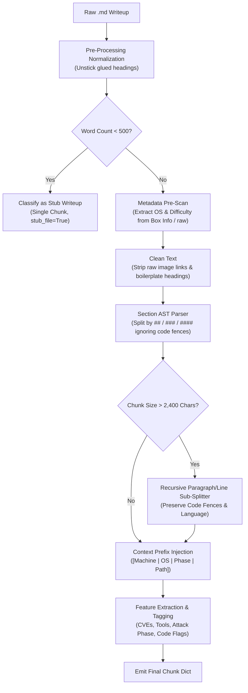

# Design Notes — HTB Cheatsheet Assistant (RAG)

## 1. Chunking Strategy

### 1.1 Why Standard Chunking Fails on HTB Writeups
Fixed-size sliding-window chunking (e.g., 512 tokens with 50-token overlap) is standard for generic NLP corpora but catastrophically destructive for Hack The Box (HTB) penetration testing writeups:
- **Severed Command-Output Coupling:** Exploit chains contain multi-line commands followed directly by terminal output, banners, or proof-of-concept responses. Naive slicing breaks this coupling mid-command or mid-output, destroying the exact syntax needed for cheatsheets.
- **Loss of Attack Phase Context:** An isolated command like `secretsdump.py` looks identical whether run in initial reconnaissance, lateral movement, or post-exploitation domain compromise. Without structural heading awareness, the semantic lifecycle phase is lost.
- **Broken Code Block Fences:** Slicing mid-code-block creates orphaned triple-backtick (```) markers, corrupting Markdown AST parsers, vector embeddings, and downstream LLM synthesis prompts.

Instead of fixed windows, our chunker uses **AST- & Heading-Aware Structural Chunking** aligned with the natural offensive lifecycle (`##` Phase → `###` Step → `####` Sub-step) with deterministic length guardrails.

---

### 1.2 Ingestion & Pre-Processing Normalization
Before document segmentation, the raw Markdown undergoes targeted normalization to eliminate upstream corpus defects:



1. **Heading De-Glueing (The 97% Stuck Heading Fix):** In 449 of 462 writeups, headings lacked preceding newlines (e.g., `18d 22:54:36 Creator ## Recon`). Naive regexes (`^##\s+`) missed these, accidentally swallowing entire exploit paths into boilerplate sections. A pre-regex normalizer inserts explicit double newlines:
   ```python
   re.sub(r'([^\n#\r])[ \t]*(#{2,4}[ \t]+[A-Za-z0-9])', r'\1\n\n\2', raw)
   ```
2. **Metadata Extraction Precedence:** Operating System and Difficulty are extracted from the "Box Info" Markdown table *before* image URLs are stripped, as OS icons (``) are often the only OS indicator. A 4,000-character fallback scan ensures 98.7% OS classification coverage.
3. **Boilerplate Suppression:** Uninformative administrative sections (`## Box Info`, `## Filtering`, `## Alternative Methods for Finding IPv6`, etc.) and chunks under 80 characters are discarded to prevent search index pollution.

---

### 1.3 Writeup Shape Classification & Hierarchical Splitting
The chunker dynamically adapts its segmentation strategy based on the document's structural archetype:

| Writeup Archetype | Structural Characteristic | Splitting Strategy | Chunk Size & Output |
| :--- | :--- | :--- | :--- |
| **Normal Writeup** | Well-formed `## Phase` and `### Step` headings | Primary split at `###`. Sub-splits at `####` if a section exceeds 2,400 chars. | Focused chunks representing single attack actions (e.g., AS-REP Roasting, SQLi). |
| **Flat / Old Writeup** | Missing `###` headings; only `## Phase` present | Falls back to splitting directly on `## Phase` sections. | Coarser chunks bounded by phase transitions. |
| **Mega Writeup** | Dense, monolithic writeup (>100 KB, sparse headings) | Recursively split via `_split_into_paragraphs` with a strict budget of 2,400 chars (~600 tokens). | Tightly bounded chunks ensuring zero truncation in Gemini embedding API. |
| **Stub Writeup** | Very short writeup (<500 words total) | Emitted as a single comprehensive chunk flagged `stub_file=True`. | Preserves end-to-end walkthrough context in one retrieval unit. |

#### Code-Block Fence Integrity & Budget Splitting
When an individual section exceeds the 2,400-character ceiling (`CHUNK_TOKEN_LIMIT = 600` tokens ≈ 2,400 characters):
1. The text is split along paragraph boundaries (`\n\n`), falling back to line boundaries (`\n`) and character slices if individual lines are oversized.
2. An 80-character safety buffer is reserved to balance open code blocks.
3. If a split occurs inside a fenced code block, the chunker cleanly terminates the block with `\n``` ` and re-opens it in the subsequent chunk with the identical language identifier (e.g., ` ```bash\n ` or ` ```python\n `), preventing Markdown syntax corruption.
4. Heading finders (`_split_at_level`) compute code block ranges beforehand and actively ignore any `#` characters located inside fenced code blocks.

---

### 1.4 Context Injection: Rich Semantic Breadcrumbs
Standard embeddings suffer from the "out-of-context retrieval" problem: a retrieved chunk showing `certipy req -u user@domain -p pass` often lacks the target machine name, target OS, or attack phase. 

To guarantee perfect retrieval grounding and enable zero-overhead citation during generation, every chunk text is automatically prepended with a structured semantic header:

```text
[Machine: Certified | OS: Windows | Phase: Privesc | Path: Exploitation > ADCS Abuse > ESC9]

<Section content, commands, output, and prose...>
```

- **Lexical Impact:** BM25 instantly matches queries like `"Certified Windows privesc"` or `"ADCS Exploitation"` even if those exact words are not repeated in the chunk body.
- **Dense Vector Impact:** Gemini embeddings (`models/gemini-embedding-001`) utilize the prefix to align the chunk's vector representation with the specific attack phase and target platform.
- **Synthesizer Attribution:** The LLM generator parses the prefix directly to cite machines (`(seen on: Certified)`) without requiring complex side-channel metadata tracking.

---

### 1.5 Metadata Schema & Automated Feature Extraction
Each chunk is persisted in ChromaDB with 15 typed metadata attributes used for hard filtering, hybrid scoring, and knowledge graph construction:

| Field | Type | Description / Extraction Method |
| :--- | :--- | :--- |
| `source` | `str` | Raw file stem identifier (e.g., `htb-certified`). |
| `machine_name` | `str` | Clean display title derived from stem (e.g., `Certified`). |
| `os` | `str` | Target OS (`windows`, `linux`, or `unknown`) extracted via Box Info / regex. |
| `difficulty` | `str` | Challenge rating (`easy`, `medium`, `hard`, `insane`). |
| `h2`, `h3`, `h4` | `str` | Hierarchical heading names capturing the document tree. |
| `breadcrumb` | `str` | Flattened path string (`H2 > H3 > H4`). |
| `chunk_type` | `str` | `summary` (intro overview), `text` (attack step), or `image_desc` (vision description). |
| `attack_phase` | `str` | Mapped to offensive lifecycle: `recon`, `foothold`, `lateral-movement`, `privesc`, `persistence`. |
| `has_cve` | `bool` | Boolean flag indicating presence of CVE identifiers. |
| `cve_ids` | `list[str]` | Deduplicated list extracted via regex `CVE-\d{4}-\d+`. |
| `tools_mentioned` | `list[str]` | Exact word-boundary match across 30+ offensive tools (`bloodhound`, `certipy`, `evil-winrm`, etc.). |
| `has_code` | `bool` | True if fenced (` ``` `) or 4-space indented blocks exist. |
| `stub_file` | `bool` | Flag denoting writeups under 500 words. |

---

### 1.6 Multimodal Image Chunking
CTF writeups frequently encode pivotal exploit details exclusively within screenshots (e.g., BloodHound graph paths, Burp Suite HTTP requests, or Wireshark packet dumps):
- **Raw Image Stripping:** Raw Markdown image tags (``) are removed from text chunks to avoid embedding garbage URLs and broken asset links.
- **Gemini Vision Processing:** Non-decorative screenshots (excluding generic OS icons and badges) are processed asynchronously via `gemini-2.5-flash`.
- **Dedicated Image Chunks:** The generated technical descriptions are stored as discrete chunks (`chunk_type="image_desc"`) prefixed with `[Image description]`. These chunks inherit the full parent metadata (machine, OS, attack phase, breadcrumb), allowing graphical exploit evidence to participate seamlessly in hybrid retrieval.

## 2. Retrieval Choice

Pure BM25 fails on broad queries. Asking for a "Windows privilege escalation cheatsheet" returns nothing useful because writeups say "abuse GenericAll" or "exploit ESC9" — they rarely contain the phrase "privilege escalation" verbatim. Pure embedding search fails in the opposite direction: exact identifiers like `CVE-2026-4480`, tool flags (`--alt-security-identities`), or usernames sit in a sparse region of embedding space with poor nearest-neighbour recall.

The hybrid approach addresses both failure modes. BM25 handles exact CVE, tool, and flag lookups. Gemini `text-embedding-004` vectors handle conceptual queries, using asymmetric task types (`RETRIEVAL_QUERY` vs `RETRIEVAL_DOCUMENT`) for better query-document alignment. The NetworkX knowledge graph surfaces cross-machine relationships — when the user asks about ADCS, the graph links techniques to every machine that demonstrated them, enabling citations like *(seen on: Certified, Absolute)*.

Reciprocal Rank Fusion merges the BM25 and vector lists without score normalisation, avoiding the brittleness of raw score combination. ChromaDB metadata filters (`os`, `difficulty`) prune the search space before retrieval.

Hallucination carries real cost in this domain — a fabricated machine name or wrong CVE in a penetration-test cheatsheet misleads an analyst mid-engagement. Low temperature (0.1) and a strict system prompt requiring per-technique citations keep the synthesizer grounded in retrieved evidence.

## 3. Next Improvement

Cross-encoder re-ranking (`ms-marco-MiniLM-L-6-v2`) is already implemented and contributed to pushing precision from 0.66 to 0.84. The highest-impact next upgrade is **graph-assisted recall expansion for broad queries**. Currently, broad cheatsheet questions (e.g., "Windows privilege escalation cheatsheet") retrieve at most 15 diversified chunks, yielding high precision (0.84) but low recall (0.25) because the answer key expects 50–100+ machines. The knowledge graph already maps `category → technique → machine` relationships. At query time, the system could use matched graph categories to pull *all* machines linked to a technique category (e.g., every machine tagged with `Windows-Privesc`), then inject those machine names as additional citation context for the synthesizer — without retrieving extra chunks. This would dramatically improve recall on broad queries while preserving the high precision of the retrieval pipeline. The graph data is already there; the change is purely in retrieval-time expansion logic in `retriever.py`.
